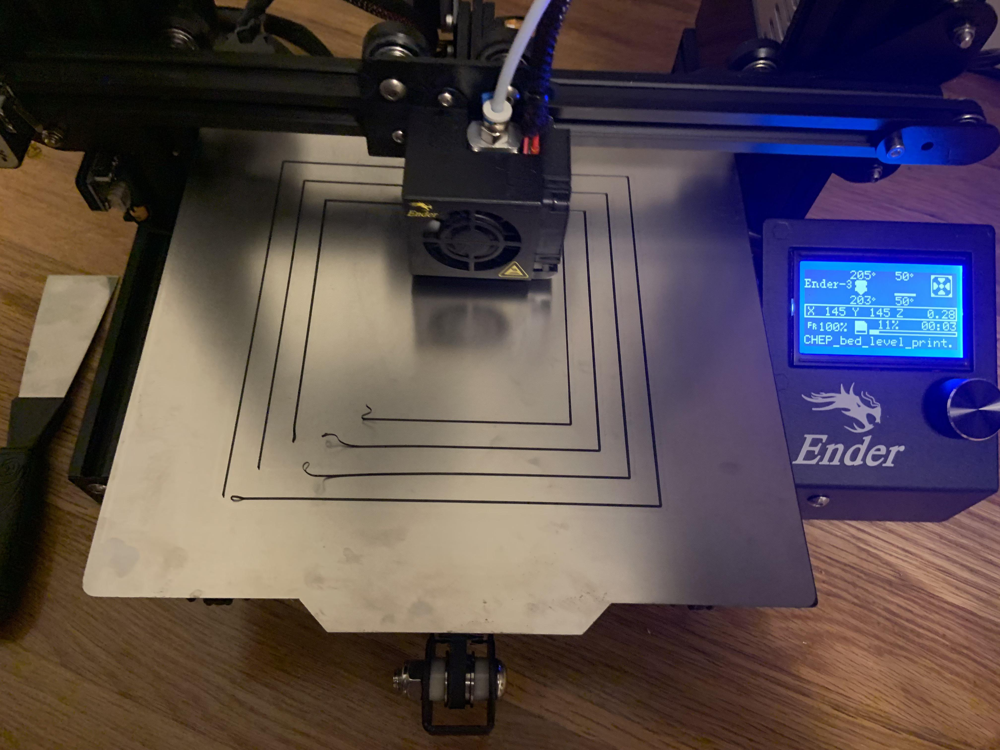

### PRINT QUALITY NOT HOMOGENOUS, BUT VARIES ACROSS THE PRINT BED

#### [BACK TO LIST OF ISSUES](../ENCOUNTERED_ISSUES.md)

*Updated 141124*
- Solved? `PARTIALLY`
- Encountered on: `n4pr` `n4+` `e5+`
- Suspected causes: `gantry` `bed`
- Prescriptions: `bed leveling` `gantry leveling` `bed cleaning` `rail cleaning`

#### Diagnosis:
Printing goes fine until it reaches certain areas or zones on the print bed, within which the filament can either NOT stick on the bed, or NOT coming out at all.

#### Causes and Solutions:
***TLDR:*** Check bed leveled?, check gantry leveled?, clean bed with alcohol, else print slower, else lower Z-offset and increase flow rate, else increase bed temp, else use different Curas.

When this happens, it tends to trace back to the fact that either the bed is not leveled properly, or the gantry is slanted, making the nozzle's trajectory across the bed a non-horizontal path. In this case, the mechanical misalignment of the printer is at fault. Make sure to level the bed properly, as well as check if the nozzle gantry is as close to being parallel to the printer's base as possible. There have been tons of online guides on both leveling your heat bed and gantry, do check them out, or find [my own written guide](guides/[GUIDE]_BED_GANTRY_LEVELING.md) for this. What I suggest, however, is that you take all of them guides as references, and designate your own way of calibrating the mechanical properties of the machine.

`Verify that both your bed and the gantry are leveled`

`Clean your bed surface and guiding rails with alcohol`

Once you have verified that the both your bed and gantry are leveled, and have eliminated the cause of mechanical misalignment, then it's time to move on to troubleshooting the slicing configuration.

When it comes to printing profiles and configurations, there are countless factors that can affect your printing quality. I once was struck with a situation where after updating my Cura software, the print quality was f*cked up, even though the printer was not physically modified, even though my printing profile remained unchanged. So definitely put this in mind, that the same printing configuration/profile can produce really drastically different printing quality on different versions or variations of the slicing software.

`Different Cura/Slicer versions/variations can result in different print quality`

Okay, once you chose your Cura software version or variation, I highly suggest that you stick to it for literally ever. Now to the real thing, the first thing that should come to your mind when tuning your profile under this circumstance is ***Z-offset***. Again, there have been numerous articles and guides online about calibrating your printer's Z-offset value, and if I had the time, I could have written another whole guide about this matter. But generally, you should not stress yourself out trying to find the best value. ***Here's a quick guide***, given that you are suspecting that your Z-offset is the problem: Make a 3D model of a very large yet flat plane (not air plane, the plain plane), and print the first few layers. Observe as it prints

#### [BACK TO LIST OF ISSUES](../ENCOUNTERED_ISSUES.md)